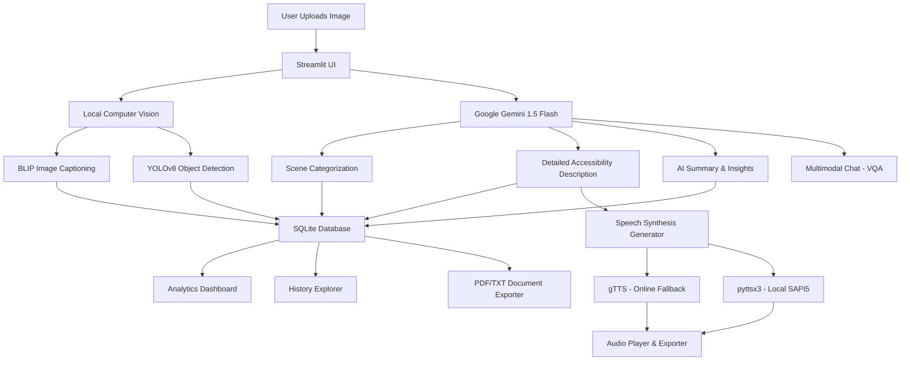

# AI Visual Accessibility Assistant

An intelligent, production-grade assistive tool designed to help visually impaired individuals perceive and interact with their surroundings. The application combines advanced local computer vision models with state-of-the-art multimodal Generative AI to deliver captions, object bounding boxes, detailed alt-text descriptions, scene classification, speech narration, and an interactive question-answering chat interface.

---

## 🏗️ Architecture Flow



---

## ✨ Features

1. **Image Upload & Metadata View:** Uploads standard formats (JPG, JPEG, PNG) and extracts name, resolution, and file size.
2. **AI Image Captioning:** Runs a local Hugging Face **BLIP** captioner model, computing a probability-based confidence score for the generated caption.
3. **YOLO Object Detection:** Runs a cached **YOLOv8** model, highlights detected items with bounding boxes, lists them in a neat table, and renders a side-by-side view.
4. **Detailed Accessibility Description:** Uses **Gemini 1.5 Flash** to draft highly detailed, spatial-aware description paragraphs specifically formatted for screen-readers.
5. **AI Summarization & Insights:** Blends BLIP text, YOLO boxes, and scene classifications to produce concise, human-like summaries and structural taxonomics (Subject, Environment, Use Case).
6. **VQA Conversational Interface:** Offers an interactive chat sidebar to let users ask follow-up questions about the active image while preserving chat history.
7. **Audio Narration (TTS):** Converts accessibility texts to speech using a local thread-safe **pyttsx3** engine, falling back seamlessly to **gTTS** (Google Text-to-Speech) if system speech drivers are unavailable.
8. **Analytics Dashboard:** Pulls from a local SQLite database to display aggregate image counts, top 10 detected objects in bar charts, and scene type distributions.
9. **History Explorer:** Retains past records and allows users to load older analyses directly back into their workspace session.
10. **Download Center:** Easily exports plain text reports, print-ready PDF reports, annotated images (PNG), and narration MP3 files.

---

## 🛠️ Setup & Installation

### Prerequisites
- Python 3.9, 3.10, or 3.11 installed.
- Active Google Gemini API Key. (Get it from [Google AI Studio](https://aistudio.google.com/)).

### Installation Steps

1. **Clone/Move to the Project Workspace:**
   ```bash
   cd C:\Users\aarya\.gemini\antigravity\scratch\ai_visual_accessibility_assistant
   ```

2. **Create a Virtual Environment:**
   ```bash
   python -m venv venv
   ```

3. **Activate the Virtual Environment:**
   - **Command Prompt (CMD):**
     ```cmd
     venv\Scripts\activate.bat
     ```
   - **PowerShell:**
     ```powershell
     venv\Scripts\Activate.ps1
     ```

4. **Install Dependencies:**
   ```bash
   pip install -r requirements.txt
   ```
   *(Note: This installs PyTorch, Transformers, Ultralytics YOLOv8, Streamlit, Gemini SDK, gTTS, pyttsx3, and ReportLab).*

5. **Set Up Environment Variables:**
   - Rename `.env.example` to `.env`.
   - Open `.env` and fill in your Gemini API key:
     ```env
     GEMINI_API_KEY=AIzaSy...
     ```

---

## 🚀 Running the Application

Start the Streamlit dashboard by running:

```bash
streamlit run app.py
```

### Initial Run Expectations
- **Model Downloads:** On the first execution, PyTorch will automatically download the BLIP captioning model weights (approx. 990MB) and YOLOv8 weights (approx. 6MB). This will happen once and is cached under your user directories.
- **Accessing the App:** The command will print local and network URLs (typically `http://localhost:8501`). Open this address in your web browser.
- **Initialize Local Models:** In the sidebar, click the **Initialize Local Models** button to load the weights into memory before running your first analysis.

---

## 📁 Codebase Structure

```
ai_visual_accessibility_assistant/
│
├── .env                  # Environment configuration with API Keys
├── requirements.txt      # Project libraries list
├── README.md             # Developer documentation
│
├── app.py                # Main Streamlit dashboard script
│
├── models/
│   ├── __init__.py
│   ├── blip_captioner.py # Class for BLIP captioning + confidence calculation
│   ├── yolo_detector.py  # Wrapper for YOLOv8 object box predictions
│   └── gemini_client.py  # Multimodal Gemini API query manager
│
├── utils/
│   ├── __init__.py
│   ├── database.py       # SQL database storage for analytics & history
│   ├── speech.py         # pyttsx3 & gTTS audio speech generation
│   └── document_exporter.py # Text & ReportLab PDF exporter
│
├── data/
│   └── database.db       # SQLite local database (auto-generated)
│
├── uploads/              # Uploaded original files storage (auto-generated)
└── outputs/              # Audio MP3s and annotated images storage (auto-generated)
```

---

## 🔧 Troubleshooting

- **Audio Driver Error (`pyttsx3`):** If you receive a driver crash error (like SAPI5 initialization failure), make sure your system's sound drivers are active. The code will automatically fall back to online **gTTS** to generate narration files.
- **Out of Memory (OOM):** If your machine runs out of memory, verify that you aren't running heavy background processes. By default, the application uses CPU. If a CUDA-enabled GPU is available, the BLIP model will use GPU acceleration.
=======
# AI-Visual-Accessibility-Assistant
>>>>>>> d683815c35ae08846efcbdc62ff9f1cf13e968ea
